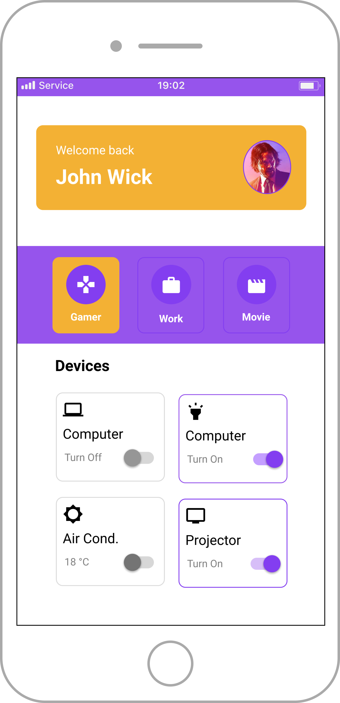

# First Screen with Jetpack Compose

Study project with the new ToolKit UI Android - Jetpack Compose

# Topics covered:

- Predefined Composables Jetpack Compose lib
- How create composables
- Preview mode
- Lists Composable Type 
- Material Theme
- Icons and Imagens local load 
- Color Extension Properties
- Dark Mode with Compose

# System Requirements

- [Android Studio Arctic Fox](https://developer.android.com/studio)
